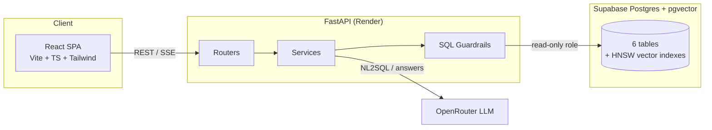
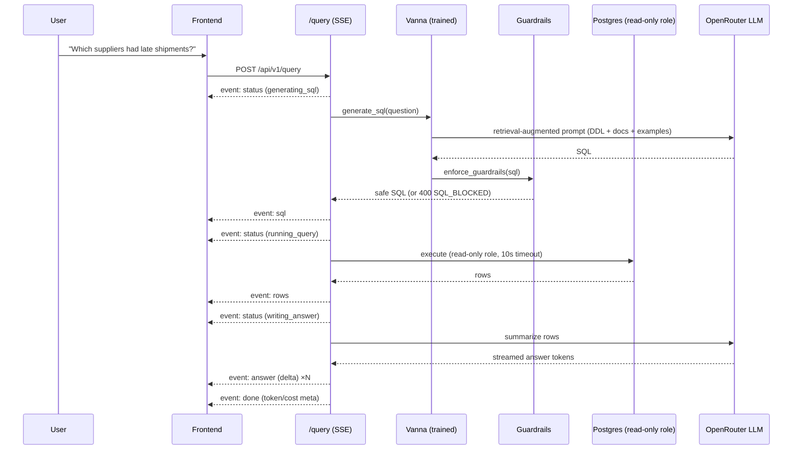
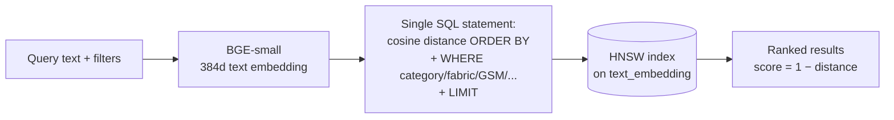
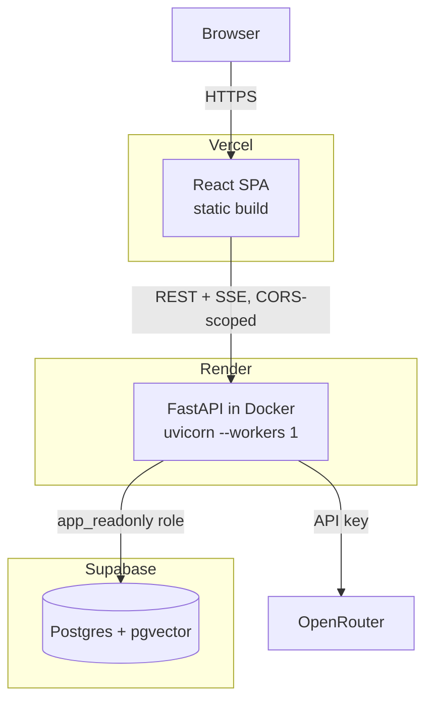

<div align="center">

# WFX Explorer

**An AI-native exploration layer over an apparel ERP.**
Ask questions in plain English, search a product catalog by meaning or by appearance, and watch the SQL and reasoning behind every answer — instead of clicking through ERP screens or writing SQL by hand.

[Live Demo](#-live-demo) · [Features](#-features) · [Architecture](#-architecture) · [Getting Started](#-installation) · [API Docs](#-tech-stack)

</div>

---

## Overview

WFX Explorer sits on top of a Postgres-modeled apparel ERP — finished goods, suppliers, buyers, sales orders, invoices, tech packs — and gives non-technical users (merchandisers, sourcing managers, finance staff) a single interface to answer questions that would otherwise require SQL or a BI tool:

- **"Which supplier has the best on-time delivery this season?"** → generated SQL, query results, and a plain-language answer, streamed live.
- **"Blue floral dress under ₹1500"** → hybrid semantic + structured product search.
- **A photo-like description of a garment** → appearance-based visual search over the catalog.
- A live dashboard of revenue, order status, and catalog composition.

It's not a chatbot bolted onto a database — it's a full-stack platform: schema design, a guarded NL→SQL pipeline, vector search, a typed REST API, and a production frontend, deployed end to end.

## 📸 Screenshots

<!--
  Add screenshots to docs/screenshots/ and update the paths below.
  Recommended: ask.png, overview.png, products.png, search.png, visual.png (1600x1000, PNG or WebP)
-->

| Ask AI | Dashboard |
|---|---|
|  |  |

| Product Search | Visual Search |
|---|---|
|  |  |

## 🔗 Live Demo

| | |
|---|---|
| **Frontend** | [your-app.vercel.app](https://your-app.vercel.app) *(replace with production URL)* |
| **API** | [your-api.onrender.com](https://your-api.onrender.com) *(replace with production URL)* |
| **API Docs (OpenAPI)** | `your-api.onrender.com/docs` |

> The API runs on a free-tier instance and may take a few seconds to wake up on the first request after a period of inactivity.

## ✨ Features

- **Natural-language querying (NL→SQL).** Ask a business question; the app generates SQL against the live schema, executes it through a guarded read-only pipeline, and writes a plain-language answer — with the SQL, the row results, and the answer all visible, streamed stage-by-stage over SSE.
- **Hybrid product search.** Free-text queries ("blue floral dress") combined with structured filters (category, fabric, GSM, color, season, supplier, price range) in a single vector + SQL query, ranked by cosine similarity.
- **Visual / appearance search.** A separate screen for describing what a garment *looks like* rather than searching its metadata, backed by precomputed image embeddings.
- **"More like this."** Every product card offers a zero-cost vector-similarity lookup against the rest of the catalog — no model call at request time.
- **Transparent AI.** Every AI-generated answer ships with the SQL that produced it and the raw result set — nothing is a black box, including when a query is blocked.
- **Finished Goods Explorer.** Paginated, filterable, sortable catalog browser with a product detail drawer (supplier info + tech pack).
- **Live dashboard.** Revenue, order status mix, and catalog composition, computed with an explicit, documented business rule (see [Business Rules](#business-rules)).
- **Command palette (⌘K)**, recent queries, responsive layout, dark "AI surface" treatment for anything the model is thinking through.

### Business Rules

Revenue is computed as **Σ(quantity × unit_price) in INR, directly from sales orders, excluding cancelled orders** — not from the invoices table, whose amounts are FX-converted into each buyer's currency and are deliberately not used for the revenue figure. This is a data-driven decision, not an oversight: it's documented so the two currency representations don't get silently conflated.

## 🏗️ Architecture

A single, internally layered FastAPI service (`routers → services → core → db`) — a monolith in deployment, modular in code — in front of Postgres + pgvector, paired with a Vite/React SPA. See [`docs/portfolio/ARCHITECTURE.md`](docs/portfolio/ARCHITECTURE.md) for full diagrams and rationale.



**Response envelope** is uniform across every endpoint: `{"data": ..., "meta": {...}}` on success, `{"error": {"code", "message", "details"}}` on failure — no exceptions, no inconsistent shapes to defend against on the client.

## 🤖 AI Pipeline (NL → SQL)



Vanna AI is trained at process startup — not on every request — from three version-controlled sources: the table DDLs (with vector columns stripped out of what the model sees), a set of domain documentation strings (units, currency rules, business definitions), and a curated bank of question→SQL example pairs. Training failing fails the boot loudly, rather than leaving the app half-alive.

**SQL guardrails** (`backend/app/core/guardrails.py`) run on every generated statement before execution:
- Must be a single statement, starting with `SELECT` or `WITH`
- SQL comments (`--`, `/* */`) are rejected outright — a common comment-smuggling vector
- A denylist blocks every DML/DDL/DCL keyword (`INSERT`, `UPDATE`, `DELETE`, `DROP`, `ALTER`, `GRANT`, `COPY`, `EXECUTE`, `SET`, …) plus `SELECT ... INTO`, matched with word boundaries so identifiers like `created_at` never false-positive
- String literals are masked before structural checks, so a data value like `'DROP off at gate 3'` is never mistaken for an attack
- An explicit `LIMIT 100` is appended if the model didn't include one

This is defense **in depth**, not the only layer: the database connection itself uses a dedicated `app_readonly` role with `default_transaction_read_only = on`, `SELECT`-only grants, and a 10-second statement timeout — a guardrail bypass still cannot write, because the role has no write privileges at the database level.

## 🔍 Search Pipeline (Hybrid Product Search)



Product Search combines a vector similarity ranking with structured relational filters **in one query** — not two separate lookups fused client-side — so "blue floral dress, GSM 180–220, from Supplier X" is a single indexed statement against `finished_goods`.

## 🖼️ Visual Search Pipeline

```mermaid
flowchart LR
    Q[Appearance query] --> ENC[Query-side text encoder]
    ENC --> IDX[(HNSW index<br/>on embedding column)]
    IDX --> Rank[Ranked results]

    ENC -.CLIP ViT-B/32 text encoder<br/>against precomputed CLIP image<br/>embeddings — design.-.-> IDX
```

Every product's image is embedded **offline, once**, using CLIP ViT-B/32 (512d) — a genuine cross-modal, appearance-based signal, not a metadata search. The full offline pipeline (`scripts/generate_embeddings.py`) computes both the 384d text embedding (BGE-small, over each product's description) and the 512d image embedding (CLIP, over the product photo) for all catalog rows, resumable and idempotent.

**A documented engineering tradeoff:** the deployed `/search/visual` endpoint currently serves results using the BGE text-embedding index rather than the CLIP image index. In a memory-capped Docker run matching the free-tier deploy target, loading the CLIP model alongside the rest of the inference stack exceeded the container's 512MB budget. Rather than risk the whole API on an OOM, the query-side CLIP encoder was swapped for the already-loaded text encoder behind the same endpoint contract — same request/response shape, same "More like this" UX, appearance queries fall back to matching against the garment's rich text description instead of its pixels. The CLIP image embeddings themselves are fully computed, indexed, and ready — re-enabling true image-vector visual search is a config change once the service runs with more memory headroom, not a rebuild. See [`docs/portfolio/CASE_STUDY.md`](docs/portfolio/CASE_STUDY.md) for the full writeup.

## 📁 Folder Structure

```
wfx-erp-explorer/
├── backend/
│   └── app/
│       ├── core/           # config, error envelope, SQL guardrails, rate limiting
│       ├── db/              # connection pool, per-domain SQL query builders
│       ├── models/          # Pydantic request/response models (extra="forbid")
│       ├── routers/         # thin FastAPI routers — parse → service call → envelope
│       ├── services/        # business logic; no FastAPI imports
│       └── vanna_training/  # DDL, domain docs, golden question→SQL pairs
├── frontend/
│   └── src/
│       ├── app/              # router, providers, entrypoint
│       ├── components/       # shared UI (shell, cards, filters) + shadcn/ui primitives
│       ├── lib/               # typed API client, SSE handling, hooks
│       └── pages/             # ask, overview, products, search, visual
├── db/
│   ├── schema.sql            # source of truth for the schema
│   └── roles.sql              # read-only runtime role
├── docs/                     # architecture, specs, design system, decision log
├── scripts/                  # local-only: seed_db.py, generate_embeddings.py, train_check.py
└── data/                     # gitignored — CSVs never committed
```

## 🧰 Tech Stack

| Layer | Technology |
|---|---|
| Frontend | React 18, TypeScript, Vite, Tailwind CSS, shadcn/ui (Radix), Recharts, react-router-dom |
| Backend | FastAPI (Python 3.11), psycopg3, Pydantic v2, structlog, slowapi |
| AI / NL2SQL | Vanna AI (in-memory ChromaDB retrieval) + OpenRouter |
| Embeddings | fastembed (ONNX runtime) — BGE-small (384d, text) + CLIP ViT-B/32 (512d, image) |
| Database | Supabase Postgres + pgvector (HNSW, cosine) |
| Deployment | Render (API, Docker) · Vercel (web) · Supabase (DB) |

## 🚀 Installation

### Prerequisites
- Python 3.11
- Node.js 18+
- A Supabase Postgres project with the `vector` extension available
- An OpenRouter API key

### Backend

```bash
cd backend
python -m venv .venv && source .venv/bin/activate
pip install -r requirements.txt

cp ../.env.example .env   # fill in real values, see below
uvicorn app.main:app --reload
```

### Frontend

```bash
cd frontend
npm install
npm run dev
```

### Database

```bash
# Apply schema + read-only role (once, via Supabase SQL editor or psql)
psql "$DATABASE_URL_OWNER" -f db/schema.sql
psql "$DATABASE_URL_OWNER" -f db/roles.sql

# Seed data (requires CSVs in data/, gitignored) and precompute embeddings
python scripts/seed_db.py
python scripts/generate_embeddings.py
```

### Tests

```bash
cd backend
pytest -q
```

## 🔐 Environment Variables

See [`.env.example`](.env.example) for the full annotated list. Summary:

| Variable | Used by | Notes |
|---|---|---|
| `DATABASE_URL` | Backend (runtime) | Must use the read-only `app_readonly` role |
| `DATABASE_URL_OWNER` | Local scripts only | Owner role — never set in production |
| `OPENROUTER_API_KEY` | Backend | NL2SQL + answer generation |
| `OPENROUTER_MODEL` | Backend | Model slug, e.g. a flash-class model |
| `LLM_MAX_TOKENS_SQL` / `LLM_MAX_TOKENS_ANSWER` | Backend | Prompt budget caps |
| `CORS_ORIGINS` | Backend | Comma-separated allowed origins |
| `RATE_LIMIT_QUERY` / `RATE_LIMIT_SEARCH` | Backend | Per-IP, per-route (slowapi) |
| `VITE_API_BASE_URL` | Frontend (build-time) | API base URL, not read by the backend |

Settings are validated at boot via pydantic-settings — a missing required key fails the deploy immediately and loudly, not silently at first request.

## ☁️ Deployment



- **Backend** ships as a single Docker image (`backend/Dockerfile`) — model caches for Chroma's embedding function and BGE-small are pre-baked at build time so a cold container doesn't re-download them on its first request; CLIP is deliberately not baked (see [Visual Search Pipeline](#-visual-search-pipeline)). Runs `uvicorn` with a single worker, since in-process singletons (DB connection, rate-limit state, the trained Vanna instance) assume one process.
- **Frontend** is a static Vite build on Vercel, with a catch-all SPA rewrite for client-side routing.
- **Database** is Supabase-managed Postgres; the app only ever connects through the least-privilege `app_readonly` role.

## 🧗 Challenges Solved

- **NL2SQL that can't be tricked into writing.** Two independent, hard-enforced layers — a regex-and-structure guardrail on generated SQL and a database role with no write grants at all — so a bypass at one layer still can't mutate data.
- **Vector search and relational filters in one query.** Rather than fusing a vector-search API and a SQL API client-side, both product search and visual search issue a single statement combining `ORDER BY embedding <=> query` with a standard `WHERE` clause, so pagination, filtering, and ranking stay consistent and indexed.
- **A 512MB memory budget.** Running an LLM-adjacent retrieval store (Chroma), two embedding model families (BGE, CLIP), and a web server in a free-tier container required verifying actual memory behavior rather than assuming it — CLIP's image encoder was moved out of the hot serving path once it was confirmed to OOM the container, with the fallback built behind the same API contract so the frontend needed zero changes.
- **Honest failure states everywhere.** A blocked query still returns the SQL that was blocked (transparency over hiding the failure); a zero-row result gets a deterministic, honest sentence instead of an LLM asked to "summarize" nothing; a dropped SSE stream is detected and surfaced as a real network error instead of hanging silently.
- **Streaming an AI answer without losing structure.** The `/query` pipeline streams five distinct stages over one SSE connection (status → sql → rows → answer tokens → done/error) so the UI can render the SQL and results *before* the prose answer finishes generating, rather than waiting on one big response.

## 🗺️ Future Improvements

- Re-enable CLIP-backed visual search once the service has memory headroom above the current free-tier ceiling (the embeddings and index already exist).
- Move the offline embedding backfill from a one-shot script into a queue worker, so new catalog rows are embedded automatically rather than by manual re-run.
- Split the modular monolith along its existing service boundaries (`nl2sql`, `search`, `dashboard`) if any one workload needs independent scaling.
- Add authenticated, per-user query history and saved searches.
- Expand the NL2SQL golden-query bank and add automated regression scoring against it in CI.

## 📄 License

This project is licensed under the [MIT License](LICENSE).

---

<div align="center">

Built as a full-stack AI/search platform — schema to deployment.

</div>
