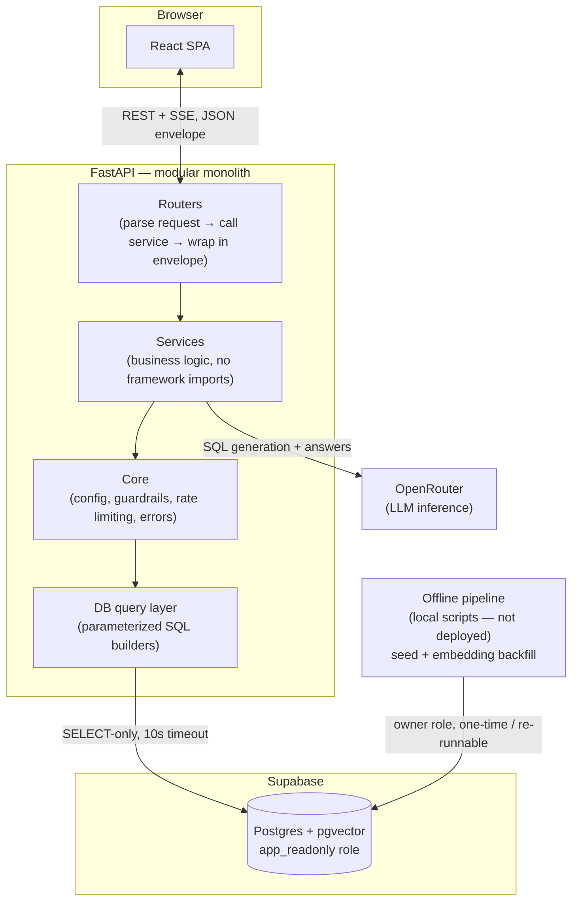
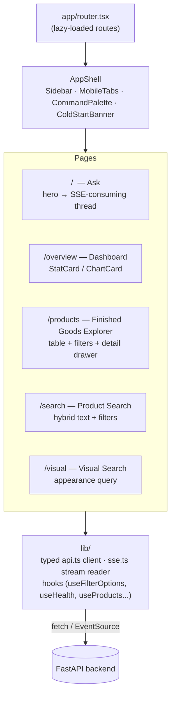
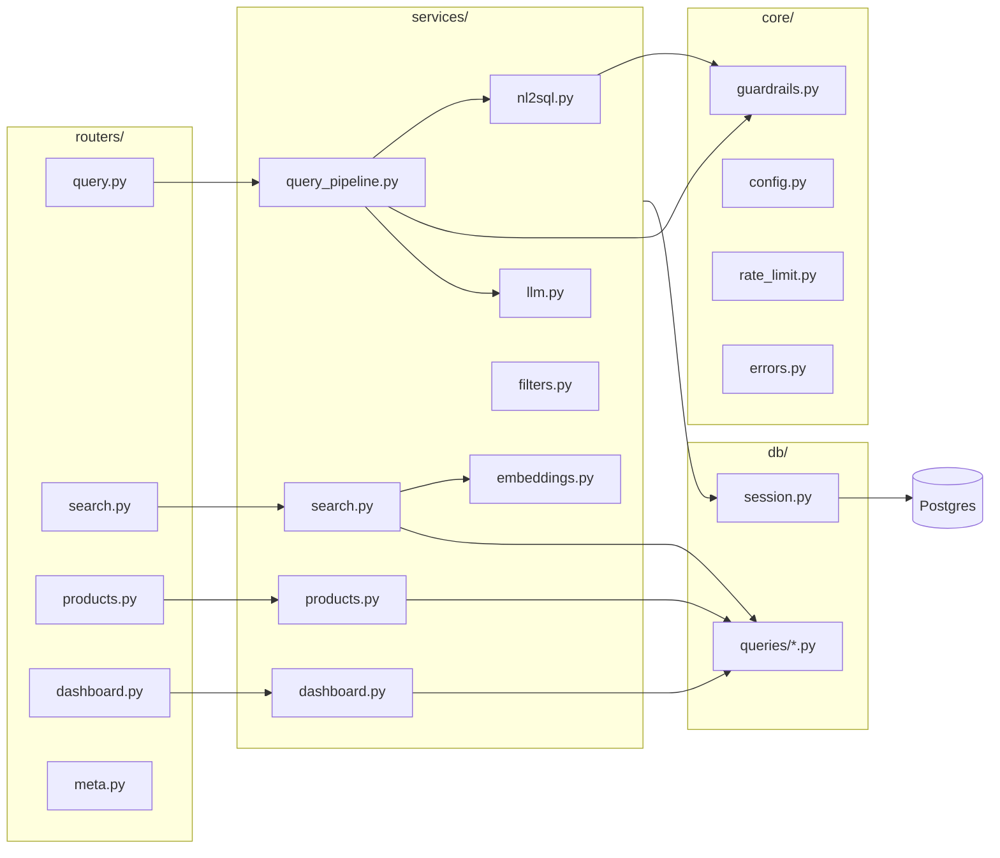
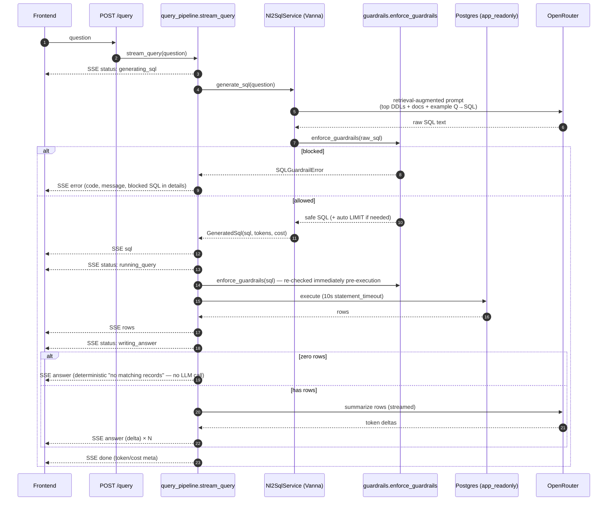
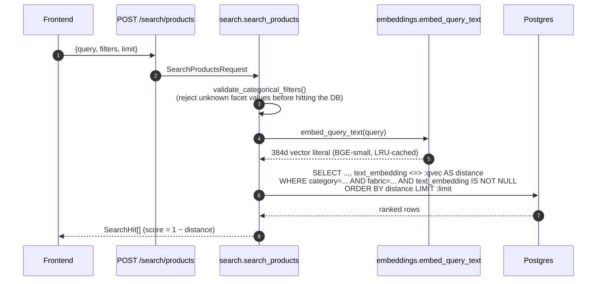
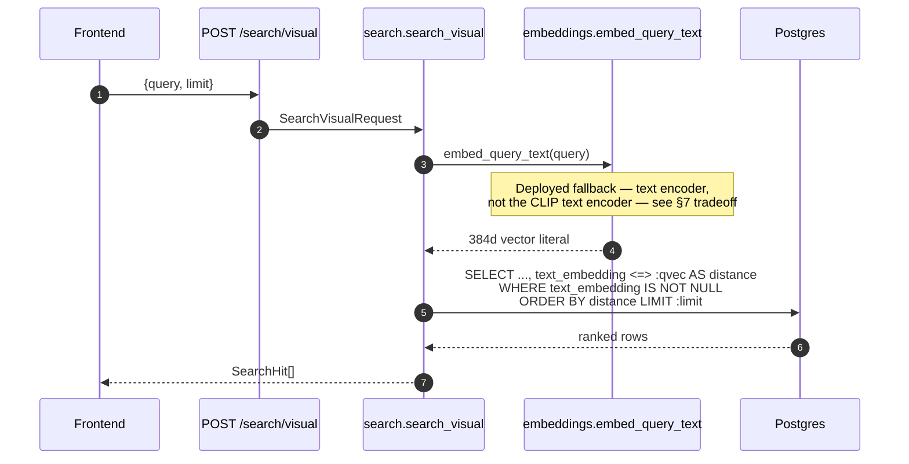
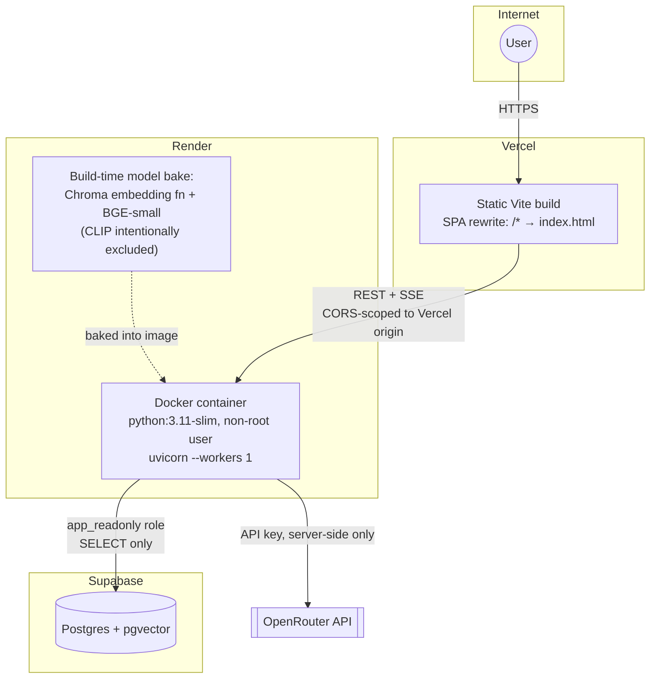
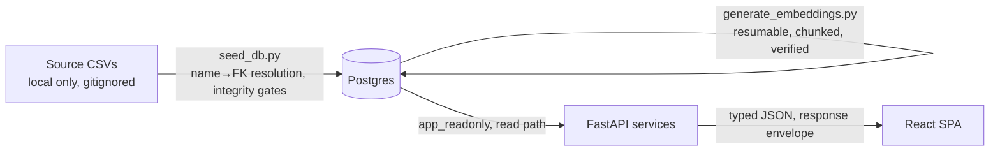

# Architecture Documentation — WFX Explorer

This document describes the production architecture of WFX Explorer: a modular-monolith FastAPI backend, a Vite/React frontend, and a Postgres + pgvector data layer, tying together NL→SQL querying, hybrid semantic search, and visual search behind a single typed API.

## 1. High-Level Architecture

A single FastAPI service, internally layered (`routers → services → core → db`) — one deployable unit, but strictly separated responsibilities in code. This was a deliberate choice over microservices: modularity is a code-quality property, not a deployment-topology requirement, and a monolith removes network/integration risk between components that all scale together anyway.

**Response contract, everywhere:** every endpoint returns `{"data": ..., "meta": {...}}` on success or `{"error": {"code", "message", "details"}}` on failure. Routers never touch SQL or call the LLM directly — they parse the validated request, call exactly one service function, and wrap the result. This keeps the transport layer (FastAPI, HTTP, SSE framing) fully separable from business logic, which is plain Python with no framework imports.

## 2. Frontend Architecture

Vite + React 18 + TypeScript, with route-based code splitting and a typed API client shared across all five screens.

- **State is local and derived from the network, not duplicated.** The Ask screen's entire thread UI (`reducer.ts`) is driven by the SSE event stream itself — there's no second fetch or separate source of truth once a stream starts.
- **Design tokens over literals.** Every color, spacing, and radius value in components resolves through Tailwind config tokens (`docs/frontend/design-system.md`) — no raw hex or off-scale pixel values in component code, enforced as a project invariant.
- **Route-driven, shareable state.** Filters and pagination live in the URL (`?style=`, `?page=`), not component state, so search/product views are linkable and back-button-safe; the Ask screen's one-off "jump here and ask this" trigger deliberately uses router state instead, since it isn't shareable view state.

## 3. Backend Architecture

- **Routers are thin by rule, not by convention drift.** No router file contains SQL or an LLM call; every route is parse → one service call → envelope.
- **Services never import FastAPI.** They're plain functions/classes that raise typed `AppError` subclasses on failure; a single global exception handler in `main.py` is the only place that turns an error into an HTTP response — one path for `AppError`, one for request validation, one for any unmatched route/method, one for rate-limit rejection, one catch-all for the truly unexpected. Nothing reaches the client outside the error envelope.
- **The NL2SQL escape hatch.** `Nl2SqlService` is the entire abstraction boundary for the AI provider — nothing outside `services/nl2sql.py` knows Vanna exists. Swapping the underlying generation strategy is a change behind one interface, not a rewrite.

## 4. AI Request Flow (NL → SQL → Answer)

Key properties:
- **Guardrails run twice** on the execution path — once right after generation, once immediately before the `cursor.execute()` call — so nothing can travel across a function boundary unchecked.
- **Vector columns are stripped from the LLM's view of the schema** (the trained DDL has `text_embedding`/`image_embedding` removed) and are also stripped from the SSE `rows` payload sent to the client, regardless of what a `SELECT *` returns at execution time — a data-hygiene measure, not a security one, since huge vector blobs would otherwise bloat both the answer prompt and the wire payload.
- **A zero-row result never reaches the LLM.** There's nothing for a model to summarize, and a fixed, honest sentence can't hallucinate over empty data.

## 5. Semantic Search Flow (Hybrid Product Search)

The defining property of "hybrid" here: **one indexed SQL statement** does both the semantic ranking and the structured filtering — not a vector-search call fused with a separate SQL call at the application layer. This keeps filter+search combinations (e.g. "blue floral dress, 180–220 GSM, from a specific supplier") consistent, paginated, and covered by the same HNSW cosine index.

## 6. Visual Search Flow

**Designed path vs. deployed path.** The catalog's `image_embedding` column (CLIP ViT-B/32, 512d) is fully populated offline for every product and backed by its own HNSW cosine index — the true appearance-search data plane exists and is queryable. The deployed `/search/visual` endpoint, however, serves results off the `text_embedding` (BGE) index under the current container's memory ceiling; see the tradeoff writeup below and in [`CASE_STUDY.md`](CASE_STUDY.md).

## 7. Deployment Architecture

- **Single-worker by design, not by oversight.** The rate limiter's in-memory counters, the DB connection singleton, the TTL caches, and the trained Vanna/Chroma instance all assume one process; `--workers 1` is a correctness constraint, not a resource-savings shortcut.
- **Model caches are baked at image-build time**, converting a runtime network dependency (re-downloading models on every cold start against Render's ephemeral disk) into a build-time one, where failures have logs, retries, and don't affect a live request.
- **The offline pipeline is not part of the deployed system.** Seeding and embedding backfill run locally against the owner DB role and are re-runnable/idempotent (resumable via `WHERE embedding IS NULL`), keeping heavy, bursty ML work off the always-on API container entirely.

## 8. Data Flow

Six tables model the domain: `suppliers`, `buyers`, `finished_goods` (the product catalog, carrying both embedding columns), `tech_packs` (1:1 with finished goods), `sales_orders`, and `sales_invoices` (1:0..1 with sales orders). The seed step resolves human-readable names to foreign keys and asserts zero referential-integrity violations before considering a load successful; the embedding backfill is a separate, independently re-runnable stage that never blocks seeding.

## 9. Security Considerations

| Layer | Control |
|---|---|
| **Database** | `app_readonly` role: `REVOKE ALL` then `GRANT SELECT` only, `default_transaction_read_only = on`, `statement_timeout = 10s`. Even a total application-layer compromise cannot write. |
| **Generated SQL** | Single-statement enforcement, `SELECT`/`WITH`-only start, keyword denylist (DML/DDL/DCL + `SELECT...INTO`), SQL-comment rejection (blocks comment-smuggling), string-literal masking before structural checks (data values never trip keyword/statement-count checks), automatic `LIMIT 100` injection. |
| **Input validation** | Every request/response is a Pydantic v2 model with `extra="forbid"` — unexpected fields are rejected, not silently ignored. Categorical filter values are validated against a live, cached facet set, not just type-checked. |
| **Error handling** | A single set of exception handlers guarantees every response — including 404s, 422s, and truly unexpected exceptions — is shaped as the standard envelope; internal error details never leak into a 500 response body. |
| **Secrets** | Read only from environment via `pydantic-settings`; validated at boot (fails loudly on missing keys, not silently on first request); `.env` is gitignored, only `.env.example` (with placeholder values) is committed. |
| **Rate limiting** | Per-IP, per-route limits (`slowapi`) on both `/query*` and `/search/*` — independent buckets so a burst against one doesn't starve the other. |
| **CORS** | Explicit allow-list of origins from config, `GET`/`POST` only, credential-less. |
| **Transport** | HTTPS end-to-end (Vercel + Render both terminate TLS); the API trusts `X-Forwarded-*` only because Render's proxy is the sole path to the container. |

**Known, accepted tradeoff:** guardrails are currently the primary enforcement layer for the SQL-execution path at runtime (the database role's own read-only settings are the second, independent layer, but are provisioned as a one-time setup step outside the app's own deploy automation) — a two-layer model chosen deliberately over building a full SQL parser, since every statement on this path is LLM-generated, never handwritten, and the cost of a full parser was judged disproportionate to the actual attack surface.
