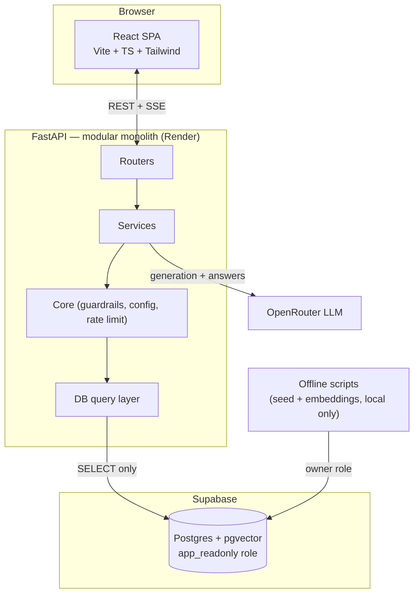
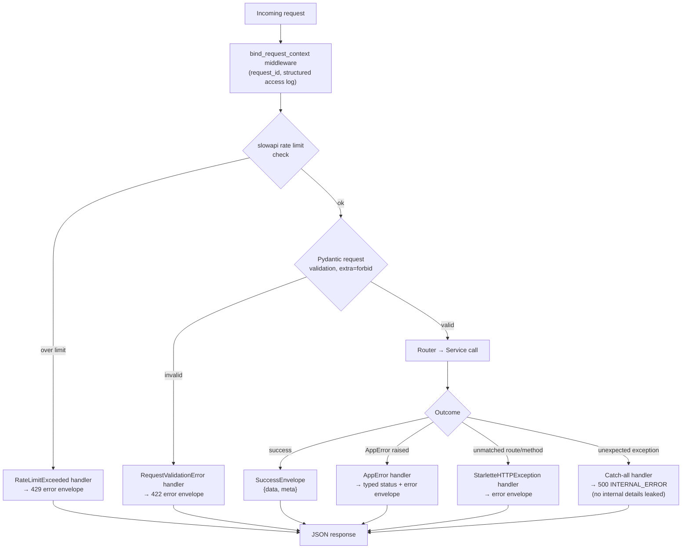
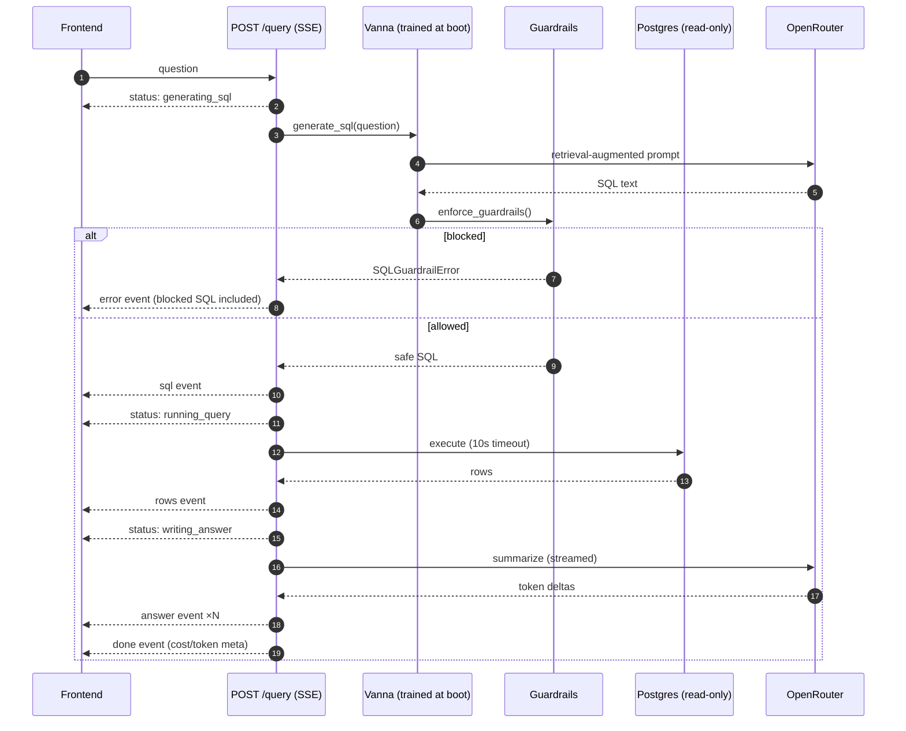
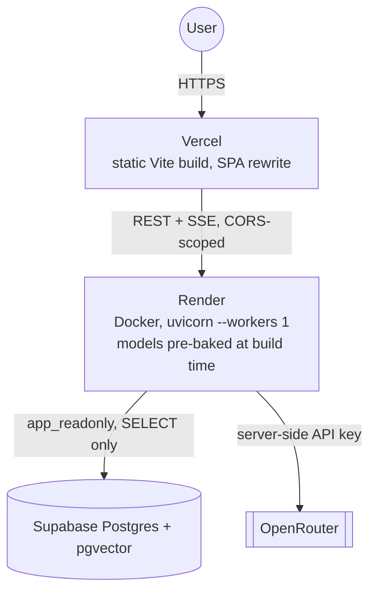
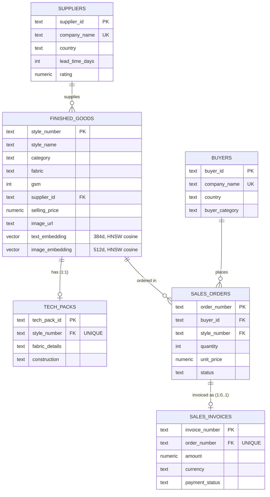

# System Diagrams — WFX Explorer

Standalone reference of every system diagram, for pulling into slides, a portfolio page, or anywhere Mermaid doesn't render natively (GitHub, most IDEs, and Notion render these directly; export to PNG/SVG via the Mermaid CLI or mermaid.live for anywhere else).

The overall-architecture, AI-pipeline, and search-flow diagrams here match [`ARCHITECTURE.md`](ARCHITECTURE.md) exactly (single source of truth, duplicated here for convenience) — the request-lifecycle and database-relationship diagrams are additions specific to this reference.

## 1. Overall Architecture



## 2. Request Lifecycle

Every HTTP request through the backend, including the error-handling paths — this is what makes the response envelope (`{"data"...}` / `{"error"...}`) a guarantee rather than a convention.



## 3. AI Pipeline (NL → SQL → Answer)



## 4. Search Flow (Hybrid Product Search)

```mermaid
flowchart LR
    Q[Query text + filters] --> V{validate filters<br/>against cached facets}
    V --> Emb[BGE-small embedding<br/>384d, LRU-cached]
    Emb --> SQL["ORDER BY text_embedding <=> qvec<br/>WHERE category/fabric/GSM/...<br/>LIMIT n — one statement"]
    SQL --> HNSW[(HNSW cosine index)]
    HNSW --> Result[Ranked SearchHit[]<br/>score = 1 − distance]
```

## 5. Deployment



## 6. Database Relationships



`finished_goods` is the hub of the schema — it's the only table both the relational filters and the two vector-search paths query against. Revenue is computed directly from `sales_orders.quantity × sales_orders.unit_price` in INR, excluding `status = 'Cancelled'`; `sales_invoices.amount` is a separately FX-converted figure and is deliberately not used for the revenue calculation, to avoid conflating the two currency representations.
